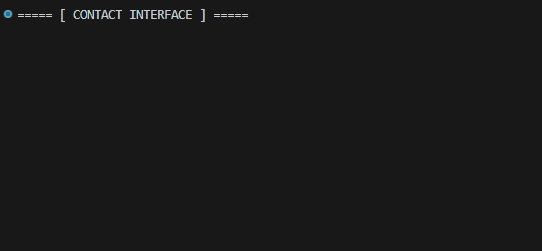

<p align="center">
   
</p>

<p align="center">
  <a href="https://git-scm.com/"></a>&nbsp;
  <a href="https://docs.python.org/3/"></a>&nbsp;
  <a href="https://daringfireball.net/projects/markdown/"></a>&nbsp;
  <a href="https://code.visualstudio.com/"></a>&nbsp;
  <a href="https://github.com/features/actions"></a>&nbsp;&nbsp;&nbsp;&nbsp;&nbsp;&nbsp;
  
</p>

<div align="center">
  <table border="0" cellpadding="0" cellspacing="0" width="80%" style="border-collapse: collapse; border: none;">
    <tr style="border: none;">
      <td width="60%" valign="middle" style="border: none; padding: 0;">
        
      </td>
      <td width="40%" align="right" valign="middle" style="border: none; padding: 0;">
        
      </td>
    </tr>
  </table>
</div>

## 💡 The Concept
> **Turning raw ideas into reliable code.**
> This laboratory is a systematic log of my journey through Python and software engineering. Here, every script is a step toward mastering the art of **structured logic**.

## 📂 Organization
- **/python**: All Python-related development.
  - `core-projects`: End-to-end applications and refined solutions.
  - `raw-sketches`: Early-stage concepts and experimental scripts.
      - `fundamentals`: echnical foundation, including sandbox, web scraping, and showcases.
      - `notes`: Idea documentation and decision logs (.md files).
      - `assets`: Visual assets and project media.

> *"Design is not just what it looks like and feels like. Design is how it works."*
---

```python
# Contact Protocol - Human Interface
MY_DATA = {
    "LinkedIn": "in/kauanhorvath",
    "Instagram": "@Just_Horvath",
    "E-mail": "kauanhorvath1996@gmail.com",
    "Whatsapp": "+55 11 95492-0195"
}

def start_hiring_process(data_source: dict):
    print("===== [ CONTACT INTERFACE ] =====")
    for platform, info in data_source.items():
        typewriter_effect(f"executing_connect_to('{platform}')")
```
---

<div align="center">
  <table border="0" cellpadding="0" cellspacing="0" style="border-collapse: collapse; width: 100%; max-width: 600px; border: none;">
    <tr>
      <td align="center" valign="middle" width="60%" style="border: none; padding: 0;">
        
      </td>
      <td align="center" valign="middle" width="40%" style="border: none; padding-left: 25px;">
        
        <p style="margin: 0; line-height: 1.2; letter-spacing: 1px;">
        </p>
      </td>
    </tr>
  </table>
</div>

<p align="right">
  <a href="https://github.com/kauan-horvath/turning-chaos-into-code/actions/workflows/lint.yml">
    
  </a>
</p>

  
## 🔗 Let's Connect

<p align="center">
  <a href="https://wa.me/5511954920195?text=HI!%20I%20came%20from%20your%20github%20let%27s%20connect?"></a>
  <a href="https://www.linkedin.com/in/kauanhorvath/"></a>
  <a href="https://www.instagram.com/just_horvath/"></a>
  <a href="mailto:kauanhorvath@exemplo.com"></a>&nbsp;&nbsp;&nbsp;&nbsp;&nbsp;&nbsp;
   <a href="https://letterboxd.com/H0rvath/"></a><a href="https://letterboxd.com/h0rvath/reviews/"></a>
  
</p>
