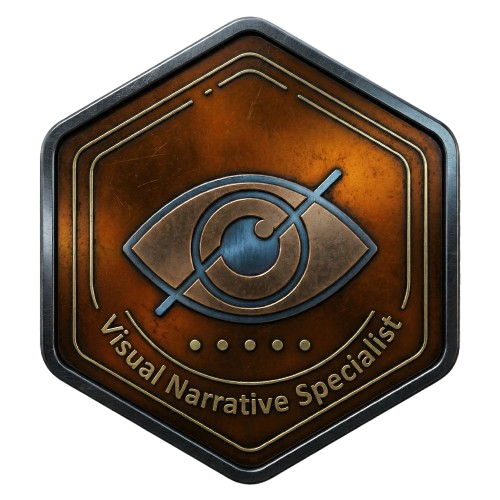

<p align="center">
  
</p>

# Turning Chaos into Code

<p align="left">
  <a href="https://docs.python.org/3/">
    
  </a>
  
  <a href="https://git-scm.com/">
    
  </a>

  <a href="https://code.visualstudio.com/updates">
    
  </a>
</p>

<table border="0" cellpadding="0" cellspacing="0" width="100%">
  <tr>
    <td width="60%" valign="top" style="border: none;">
      <p>This repository is a systematic log of my journey through software engineering and logic.</p>
      <p>It serves as a <b>laboratory</b> where I transform complex ideas and creative chaos into structured, functional code.</p>
    </td>
    <td width="40%" align="right" valign="top" style="border: none;">
      
    </td>
  </tr>
</table>

## 📂 Organization
- **/python**: All Python-related development.
  - `core-projects`: End-to-end applications and refined solutions.
  - `raw-sketches`: Early stage concepts and experimental scripts.

> *"Design is not just what it looks like and feels like. Design is how it works."*
---

```python
# Contact Protocol - Human Interface
MY_DATA = {
    "LinkedIn": "in/kauanhorvath",
    "Instagram": "@Just_Horvath",
    "E-mail": "kauanhorvath1996@gmail.com",
    "Whatsapp": "+55 11 95492-0195"
}

def start_hiring_process(data_source: dict):
    print("===== [ CONTACT INTERFACE ] =====")
    for platform, info in data_source.items():
        typewriter_effect(f"executing_connect_to('{platform}')")
```
---

<div align="center">
  <table border="0" cellpadding="0" cellspacing="0" style="border-collapse: collapse; width: 100%; max-width: 600px; border: none;">
    <tr>
      <td align="center" valign="middle" width="70%" style="border: none; padding: 0;">
        
      </td>
      <td align="center" valign="middle" width="30%" style="border: none; padding-left: 25px;">
        
        <p style="margin: 0; line-height: 1.2; letter-spacing: 1px;">
          <br>
          <span style="font-size: 16px;"><b>𝐇 𝟎 𝐑 𝐕 𝐀 𝐓 𝐇</b></span><br>
          <span style="font-size: 12px; color: #8b949e;"><i>𝕊𝕡𝕖𝕔𝕚𝕒𝕝𝕚𝕤𝕥</i></span>
        </p>
      </td>
    </tr>
  </table>
</div>
 
---

## 🔗 Let's Connect
<p align="right">
  <a href="https://www.linkedin.com/in/kauanhorvath/">
    
  </a>
  <a href="https://www.instagram.com/just_horvath/">
    
  </a>
</p>
