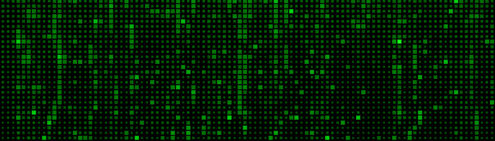

<!-- BANNER AREA ----------------->
<p align="center">
   
</p>

<!-- BADGES AREA ----------------->
<p align="center">
  <a href="https://git-scm.com/"></a>
  <a href="https://docs.python.org/3/"></a><a href="https://www.crummy.com/software/BeautifulSoup/bs4/doc/"></a><a href="https://support.microsoft.com/en-us/access"></a><a href="https://github.com/features/actions"></a>
  &nbsp;&nbsp;&nbsp;&nbsp;&nbsp;&nbsp;&nbsp;&nbsp;&nbsp;&nbsp;&nbsp;&nbsp;&nbsp;&nbsp;&nbsp;
  
</p>

<p align="center">
  
</p>

<!-- TEXTS AREA ----------------->
## 💡 The Concept
> **Turning raw ideas into reliable code.**
> This laboratory is a systematic log of my journey through software engineering. Here, every script is a step toward mastering **scalable logic** and structured architecture.

## 📂 Organization (Scalable Architecture)
- **[`/care-projects`](./care-projects)**: The "Crown Jewels." End-to-end applications and refined solutions.
- **[`/knowledge-run`](./knowledge-run)**: The "Speedrun Arena." Structured study logs (Automation, Web Stack, Database).
  - `notes`: Technical reflections, architecture dilemmas, and decision logs.
- **[`/experimenting`](./experimenting)**: The Laboratory. Sandbox testing and fundamental logic using the **Blank Model** pattern.
- **[`/assets`](./assets)**: Visual assets, project media, and branding.
---

<!-- ESATER EGG AREA ----------------->
```python
# Contact Protocol - Human Interface
MY_DATA = {
    "LinkedIn": "in/kauanhorvath",
    "Instagram": "@Just_Horvath",
    "E-mail": "kauanhorvath1996@gmail.com",
    "Whatsapp": "+55 11 95492-0195"
}

def start_hiring_process(data_source: dict):
    print("===== [ CONTACT INTERFACE ] =====")
    for platform, info in data_source.items():
        typewriter_effect(f"executing_connect_to('{platform}')")
````

----

<div align="left">
  <table border="0" cellpadding="0" cellspacing="0" style="border-collapse: collapse; width: 100%; max-width: 1000px;">
    <tr>
      <td align="center" valign="middle" width="30%" style="padding: 10px; border: none;">
        
      </td>
      <td align="left" valign="middle" style="padding: 10px 0px 10px 15px; border: none; font-family: sans-serif;">
        <strong style="font-size: 1.2em; color: #f0f6fc;">Cisco Networking Academy</strong><br>
        <span style="font-size: 1.0em; color: #1BA0D7; font-weight: bold;">Learn-A-Thon 2025</span><br>
        <p style="font-size: 0.9em; color: #8b949e; line-height: 1.5; margin: 8px 0 0 0; max-width: 500px;">
          I am a dedicated tech enthusiast constantly refining my skills in digital infrastructure. <br>This Learn-A-Thon was a marathon focused on networking fundamentals and scalable architecture. I actively participate in these challenges to ensure my technical foundation remains solid and up to date with industry standards. I believe that mastering the basics is the first step toward building complex, reliable systems. <br><br> I ⚡ a well-structured network and the logic behind efficient data flow.
        </p>
        </p>
      </td>
    </tr>
  </table>
</div>

----
<br>

## 🎓 Education & Technical Certifications

### 01 - Automation & Data
[](https://github.com/kauan-horvath/turning-chaos-into-code/blob/main/assets/certificates/microsoft-access-completion.pdf)


### 02 - Web Stack


### 🛡️ Quality & Safety
[](https://github.com/kauan-horvath/turning-chaos-into-code/blob/main/assets/certificates/Learn-A-Thon_2025_certificate_kauanhorvath_completion.pdf)


<!-- CONTACT AREA ----------------->
## 🔗 Let's Connect

<p align="center">
      <div style="line-height: 1;">
        <a href="mailto:kauanhorvath1996@gmail.com" target="_blank" style="text-decoration: none;"></a>
        <a href="https://wa.me/5511954920195?text=HI!%20I%20came%20from%20your%20github%20let%27s%20connect?" target="_blank" style="text-decoration: none;"></a>
        <a href="https://www.linkedin.com/in/kauanhorvath/" target="_blank" style="text-decoration: none;"></a>
        <a href="https://www.instagram.com/just_horvath/" target="_blank" style="text-decoration: none;"></a>
         &nbsp;&nbsp;&nbsp;&nbsp;&nbsp;&nbsp;&nbsp;&nbsp;&nbsp;&nbsp;&nbsp;&nbsp;&nbsp;&nbsp;&nbsp;&nbsp;&nbsp;&nbsp;
         <a href="https://letterboxd.com/H0rvath/" target="_blank" style="text-decoration: none;"></a><a href="https://letterboxd.com/h0rvath/reviews/" target="_blank" style="text-decoration: none;"></a>
      </div>
</p>
